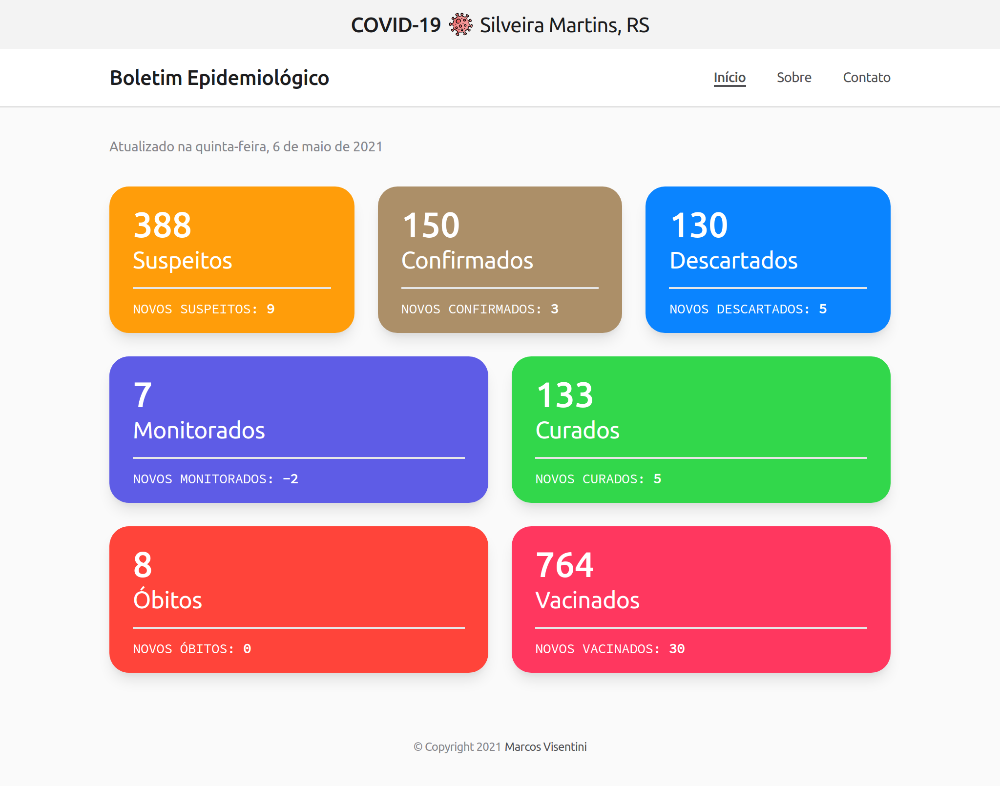

# Boletim Epidemiológico COVID-19 | Silveira Martins, RS

Uma alternativa ao [boletim epidemiológico](https://silveiramartins.rs.gov.br/coronavirus/boletim-epidemiologico) disponível no site da Prefeitura Municipal de Silveira Martins a respeito da pandemia de COVID-19 no munícipio. Os dados que o compõe são obtidos de forma automatizada por meio da técnica de web scraping e disponibilizados em formato JSON através de uma API REST, hospedada na plataforma Heroku. Para construir o back-end, utilizei as tecnologias Python e Flask. Já no front-end, HTML, CSS e JavaScript. O site está disponível em: [wisentini.github.io/covid-19-silveira-martins/](https://wisentini.github.io/covid-19-silveira-martins/).

